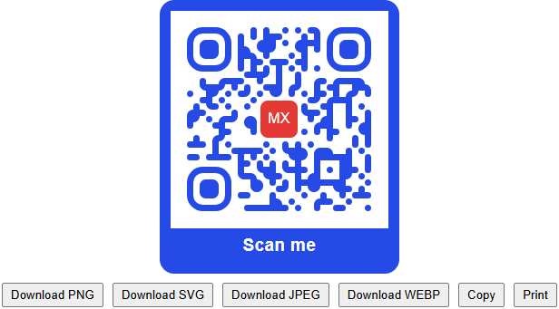
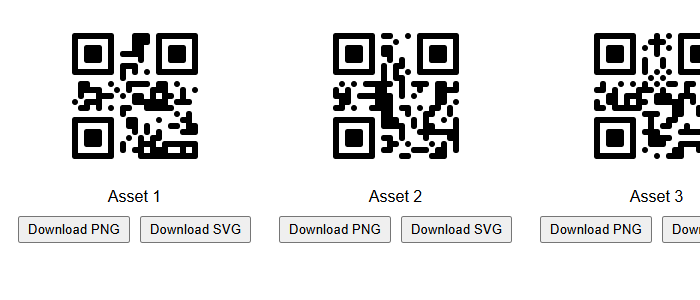

# Styled QR Code

> Branded QR codes for Mendix: dot and corner styles, gradients, logo, circle shape, frames, 17 payload
> templates (UPI, Wi-Fi, vCard, calendar, SEPA, PayNow, …), save to an attribute, multi-format export,
> ZIP and label-sheet PDF for lists, auto refresh with expiry, a scannability self-test and bulk rendering.

A Mendix pluggable widget built on [qr-code-styling](https://github.com/kozakdenys/qr-code-styling)
(rendering, styling, logo, gradients, SVG/PNG/JPEG/WEBP export) and [jsQR](https://github.com/cozmo/jsQR)
(decodes the rendered code again to check that it still scans). A separate, optional scanner widget
lives in [../styledQRScanner](../styledQRScanner) and is not part of this package.



- Mendix 11.0 or newer, web only
- Category: Display
- License: Apache-2.0

## Installation

Download `com.mxtechies.widget.web.StyledQRCode.mpk` from the
[latest release](https://github.com/bharathidas/StyledQRCode/releases) (or the Mendix Marketplace)
and drop it into the `widgets` folder of your app, then press F4 in Studio Pro.

## Usage

1. Drop **Styled QR Code** on a page.
2. Pick a **Payload** and fill its fields, or leave it on *Text or URL* and set **Value**
   (an expression such as `'https://mxtechies.com'` or `$currentObject/Code`).
3. Style it on the **Design** tab: dot style, colours, gradients, logo, background, frame.
4. Optionally bind a **Base64 attribute** on the *Save to Mendix* tab to keep the image in your data.

### Payload templates

| Payload | Fields | Encoded as |
| --- | --- | --- |
| Text or URL | Value | as is |
| UPI payment | Payee VPA, payee name, amount, currency, note, transaction reference | `upi://pay?pa=…&pn=…&am=…&cu=INR&tn=…&tr=…` |
| Wi-Fi login | SSID, password, encryption (WPA / WEP / open), hidden | `WIFI:T:WPA;S:…;P:…;H:true;;` |
| vCard contact | Version 3.0/4.0, names, organization, title, phones, email, website, address (single line or parts), birthday, photo, note | vCard |
| Email | To, subject, body | `mailto:…?subject=…&body=…` |
| SMS | Number, message | `SMSTO:number:message` |
| Phone call | Number | `tel:number` |
| Geo location | Latitude, longitude | `geo:lat,lng` |
| Map link | Latitude, longitude, map app, label | Google / Apple / OpenStreetMap link or `geo:` URI |
| Calendar event | Title, start, end, all day, location, description | iCalendar `VEVENT` |
| WhatsApp chat | Number, message | `https://wa.me/number?text=…` |
| Telegram | Username, message | `https://t.me/user?text=…` |
| SEPA bank transfer (EPC) | Beneficiary, IBAN, BIC, amount, structured reference or remittance text, purpose | EPC069-12 "BCD" code |
| Bitcoin payment | Address, amount, label, message | `bitcoin:addr?amount=…` |
| PayPal.Me | Name, amount, currency | `https://www.paypal.me/name/10.00USD` |
| PromptPay (Thailand) | Proxy type, mobile / ID / e-Wallet, amount | EMVCo merchant-presented code with CRC-16 |
| PayNow (Singapore) | Mobile or UEN, merchant name, amount, editable, reference, expiry | EMVCo (SGQR) code with CRC-16 |

### Bulk (list) mode

Set **Render as** to *List of QR codes*, pick a **Data source** and a **Value per object** expression
(for example `$currentObject/AssetCode`). One code is rendered per object, all with the same styling,
optionally with a **Label per object**, a **File name per object** and a **Logo URL per object**.
Long lists render each code only when it scrolls into view. The list toolbar offers
**Download all (ZIP)**, **Print label sheet** and **Download label sheet (PDF)**; the sheet layout
(columns, label size in mm, gap, captions, title) is configurable and prints on A4.



Need the payload templates per object? Keep *Single QR code* and place the widget inside a list view or
gallery instead; every template field then works on `$currentObject`.

### Save the image in Mendix

Bind **Base64 attribute** (a String attribute, ideally unlimited length). After every render, and after
the configurable **Save delay**, the widget writes the image (PNG, SVG, JPEG or WEBP) as base64 into it and
runs **On image saved**. A **Save now** button can be shown as well. Use a microflow with Community
Commons `Base64DecodeToFile` to turn it into a `System.Image` for documents, emails and PDFs. Pluggable
widgets cannot write file documents directly, which is why the base64 route is used.

### Dynamic and secure codes

- **Refresh interval (s)** runs **On refresh** every N seconds (for example a nanoflow that fetches a new
  token and stores it in the attribute the Value expression reads). The code re-renders when the value changes.
- **Expires at** shows a countdown under the code (`Expires in 04:59`) and, once passed, blurs the code,
  shows the **Expired label** and runs **On expire** once.
- **On render** runs after every render with the encoded value and the scannability result, for audit logs.
- Tokens should be generated and validated server side (a microflow that signs the value with a secret the
  browser never sees). The widget deliberately has no client-side signing, because a secret in the browser
  is not a secret.

### Export

Toolbar buttons download the code as PNG, SVG, JPEG or WEBP, copy it to the clipboard as PNG, or print it
on its own. The frame, including its icon, is part of every export.

### Scannability check and limits

After each render the widget decodes the code again with jsQR. When that fails (low contrast, exotic
styling, a logo that is not excavated) it shows the **Warning text** and writes `false` to the optional
**Scannable attribute**. Use error correction **H** when you add a logo.

qr-code-styling scales the logo down to the area the chosen error correction level can recover, so a very
large logo is drawn smaller rather than breaking the code. Payloads longer than **Max payload length**
(default 1500 characters; the QR limit is 2953 bytes at level L) show the **Too long message** instead
of a failed render.

## Properties

| Tab | Group | Properties |
| --- | --- | --- |
| General | Data | Render as, Payload, Value, Caption |
| General | Templates | One group per payload type, shown for the selected payload |
| General | List | Data source, Value / Label / File name / Logo URL per object, Gap, Render when visible, Empty message |
| Design | Size and shape | Size, Sizing (fixed / fit container), Margin, Shape, Draw with (SVG / Canvas) |
| Design | Dots | Style, Colour, Gradient, end colour, rotation, colour stops, Round dot size |
| Design | Corner squares / Corner dots | Style, Colour, Gradient, end colour, rotation, colour stops |
| Design | Background | Transparent, Colour, Corner rounding, Gradient, end colour, rotation, colour stops |
| Design | Logo | Logo image, Logo URL, Size, Margin, Hide dots behind logo, Cross-origin |
| Design | Frame | Show frame, Label, Label position (top / bottom / left / right), Frame style (solid / outline / pill), Label icon, Label font, colours, corner radius |
| Encoding | QR options | Error correction, Version, Encoding mode, Max payload length, Too long message |
| Encoding | Scannability check | Check scannability, Warning text, Scannable attribute |
| Toolbar | Buttons / Labels / Label sheet | Download PNG / SVG / JPEG / WEBP, Copy, Print, Save now, Download all (ZIP), Print label sheet, Download PDF, File name, Button style, Position, labels, sheet layout |
| Save to Mendix | Image attribute | Base64 attribute, Image format, Include data URI prefix, Save delay, On image saved |
| Dynamic | Auto refresh / Expiry | Refresh interval, On refresh, Expires at, Countdown label, Expired label, Blur when expired, On expire |
| Events | Events | On click, On render |
| Accessibility | Accessibility | Aria label |

Labels use `[time]` as the placeholder for the remaining time.

## Enterprise notes

- **Security**: nothing leaves the browser; no CDN, no telemetry. Payload builders URL-encode and escape
  every field. Scanned or generated values are ordinary user input for your microflows.
- **Performance**: rendering is synchronous SVG; the self-check and base64 export run asynchronously and
  are cancelled when the props change; saves are debounced; lists render lazily.
- **Accessibility**: the code has `role="img"` with a translatable aria label, buttons are real buttons,
  the countdown and warnings use live regions, keyboard activation works when On click is set.
- **Localisation**: every label and message is a text template with translations.
- **Robustness**: render errors are shown in place instead of breaking the page; the widget never throws
  into the Mendix client.

## Styling

Root classes: `.mxt-qr` (single) and `.mxt-qr-list` (list). Inside: `.mxt-qr__code`, `.mxt-qr__frame`,
`.mxt-qr__frame-label`, `.mxt-qr__caption`, `.mxt-qr__countdown`, `.mxt-qr__expired`, `.mxt-qr__warning`,
`.mxt-qr__notice`, `.mxt-qr__toolbar`, `.mxt-qr-list__toolbar`, `.mxt-qr__button`. State classes:
`.mxt-qr--expired`, `.mxt-qr--blur`, `.mxt-qr--busy`, `.mxt-qr--clickable`, `.mxt-qr--fit`. Toolbars are
hidden when the page is printed.

## Development

```bash
npm install
npm run build     # builds and copies the .mpk into ../../widgets
npm run lint
npm run release   # minified .mpk in dist/<version>
```

## License

Apache-2.0, © MX Techies 2026.
